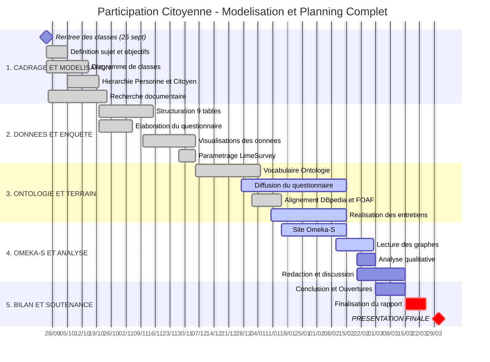

```mermaid
gantt
    dateFormat  YYYY-MM-DD
    title Participation Citoyenne - Modelisation et Planning Complet
    axisFormat  %d/%m
    tickInterval 1week
    excludes    weekends

    section 1. CADRAGE ET MODELISATION
    Rentree des classes (25 sept)    :milestone, m1, 2025-09-25, 0d
    Definition sujet et objectifs    :done, t1, 2025-09-25, 2025-10-05
    Diagramme de classes             :done, t2, 2025-09-25, 2025-10-15
    Hierarchie Personne et Citoyen   :done, t3, 2025-10-05, 2025-10-20
    Recherche documentaire           :done, t4, 2025-09-26, 2025-10-24

    section 2. DONNEES ET ENQUETE
    Structuration 9 tables           :done, t5, 2025-10-20, 2025-11-15
    Elaboration du questionnaire     :done, t6, 2025-10-20, 2025-11-05
    Visualisations des donnees       :done, t7, 2025-11-10, 2025-12-05
    Parametrage LimeSurvey           :done, t8, 2025-11-27, 2025-12-05

    section 3. ONTOLOGIE ET TERRAIN
    Vocabulaire Ontologie            :done, t9, 2025-12-05, 2026-01-05
    Diffusion du questionnaire       :active, t10, 2025-12-27, 2026-02-15
    Alignement DBpedia et FOAF       :done, t11, 2026-01-01, 2026-01-15
    Realisation des entretiens       :active, t12, 2026-01-10, 2026-02-15

    section 4. OMEKA-S ET ANALYSE
    Site Omeka-S                     :active, t13, 2026-01-15, 2026-02-15
    Lecture des graphes              :active, t14, 2026-02-10, 2026-02-28
    Analyse qualitative              :t15, 2026-02-20, 2026-03-01
    Redaction et discussion          :t16, 2026-02-20, 2026-03-15

    section 5. BILAN ET SOUTENANCE
    Conclusion et Ouvertures         :t17, 2026-03-01, 2026-03-15
    Finalisation du rapport          :crit, t18, 2026-03-15, 2026-03-25
    PRESENTATION FINALE              :crit, milestone, 2026-03-31, 0d
```
